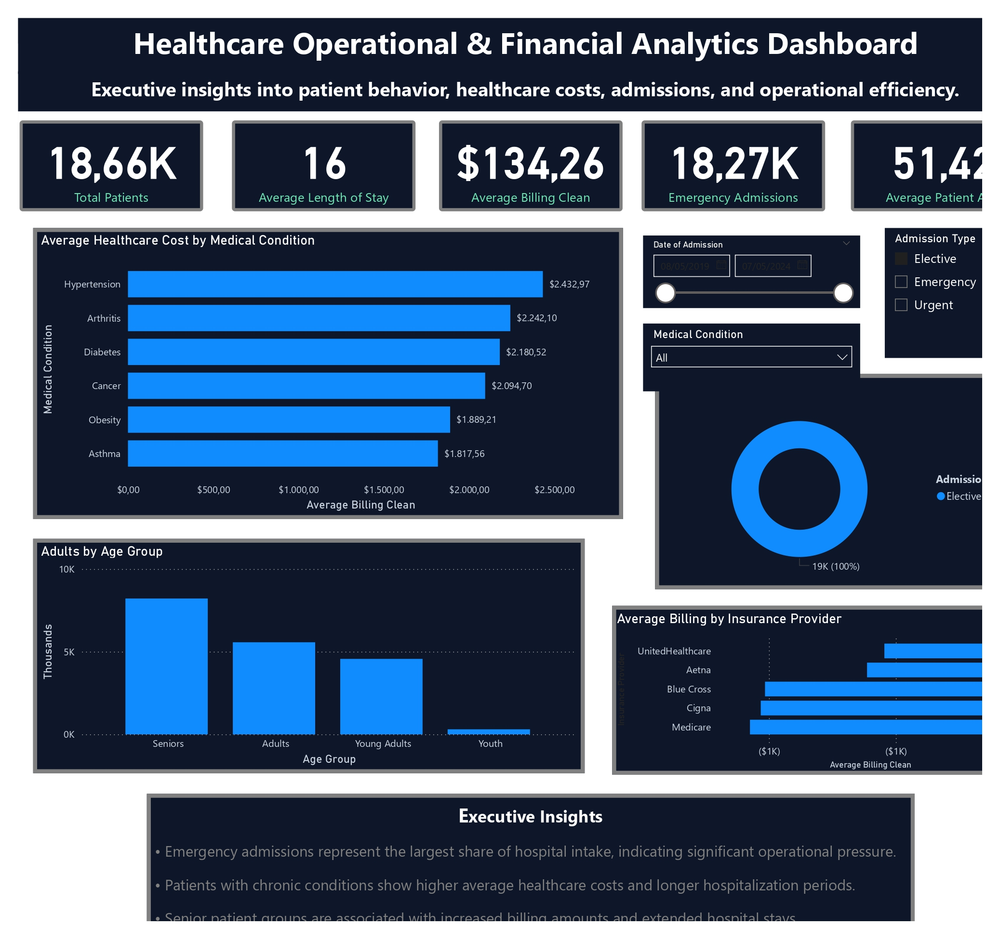

# Healthcare Operations & Cost Intelligence Dashboard

Executive healthcare analytics dashboard developed in Power BI to provide operational and financial insights into patient admissions, medical conditions, hospital efficiency, and healthcare costs.

---

## 📊 Project Overview

This dashboard was designed to support strategic decision-making by analyzing:

- Patient admissions and hospitalization trends
- Healthcare operational efficiency
- Medical condition cost analysis
- Insurance provider billing behavior
- Patient demographic segmentation
- Admission type distribution

The project demonstrates business intelligence storytelling, KPI development, and healthcare analytics visualization techniques.

---

## 🚀 Key Features

- Interactive slicers and dynamic filtering
- Executive KPI cards
- Healthcare cost analysis
- Operational insights dashboard
- Patient demographic segmentation
- Insurance billing comparison
- Admission type analytics

---

## 🛠 Tools & Technologies

- Power BI
- Power Query
- DAX
- Data Modeling
- CSV Dataset Processing

---

## 📷 Dashboard Preview

---

## 📈 Business Insights

- Emergency admissions represent the largest operational demand.
- Senior patients show higher average healthcare costs.
- Chronic conditions generate longer hospitalization periods.
- Insurance providers demonstrate significant billing variations.

---

## 📂 Files Included

- `.pbix` dashboard file
- Dashboard preview images
- Documentation

---

## 👨‍💻 Author

**Renato Saletti Santos**  
Data Analyst | Business Intelligence | Front-End Developer

LinkedIn: *(add your link)*  
Portfolio: *(add your portfolio link)*
